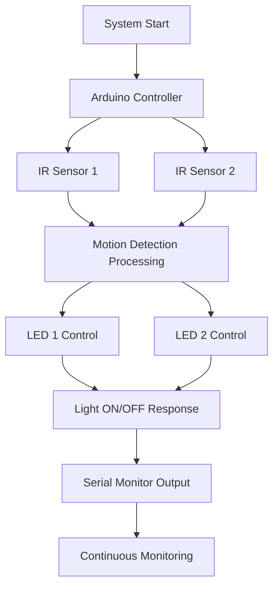

# 💡 [**MotionActivatedLightingSystem**](https://github.com/VatamRohithReddy/MotionActivatedLightingSystem)

An Arduino-based **Motion Activated Lighting System** that uses IR sensors to detect object movement and automatically controls LED lights.

This project demonstrates sensor-based automation where IR sensors detect motion or object presence, and the corresponding LEDs are switched ON/OFF based on the detection status.

---

## 🚀 Features

- 🔍 Motion/object detection using IR sensors
- 💡 Automatic LED control
- ⚡ Fast response detection
- 📡 Real-time sensor monitoring
- 🖥️ Serial Monitor feedback
- 🔄 Continuous detection loop
- 🔋 Low power automation system

---

## ⚙️ Working Principle

- IR sensors continuously monitor the surrounding area.
- When an object is detected, the IR sensor output becomes **LOW**.
- Arduino reads the sensor input.
- The corresponding LED turns ON.
- When no object is detected, the LED turns OFF.
- Sensor status is displayed through the Serial Monitor.

---

## 🔧 Hardware Components

- Arduino Uno / Microcontroller
- IR Obstacle Sensors
- LEDs
- Resistors
- Jumper Wires
- Breadboard
- Power Supply

---

## 🔌 Pin Configuration

| Component | Arduino Pin |
|-----------|-------------|
| IR Sensor 1 | D2 |
| IR Sensor 2 | D3 |
| LED 1 | D7 |
| LED 2 | D6 |

---

## 🏗️ System Architecture



---

## 💻 Code Functionality

- Reads data from two IR sensors.
- Detects object movement/presence.
- Controls two LED outputs.
- Displays detection messages using Serial Monitor.
- Runs continuously with 100ms delay between readings.

---

## 🧑‍💻 Arduino Code

```cpp
// IR Sensor with LED Indicator

int irSensorPin1 = 2;
int irSensorPin2 = 3;

int ledPin1 = 7;
int ledPin2 = 6;

void setup() {

  pinMode(irSensorPin1, INPUT);
  pinMode(irSensorPin2, INPUT);

  pinMode(ledPin1, OUTPUT);
  pinMode(ledPin2, OUTPUT);

  Serial.begin(9600);
}

void loop() {

  int sensorState1 = digitalRead(irSensorPin1);
  int sensorState2 = digitalRead(irSensorPin2);

  // IR Sensor 1
  if (sensorState1 == LOW) {
    digitalWrite(ledPin1, HIGH);
    Serial.println("IR Sensor 1: Signal detected!");
  }
  else {
    digitalWrite(ledPin1, LOW);
    Serial.println("IR Sensor 1: No signal detected.");
  }


  // IR Sensor 2
  if (sensorState2 == LOW) {
    digitalWrite(ledPin2, HIGH);
    Serial.println("IR Sensor 2: Signal detected!");
  }
  else {
    digitalWrite(ledPin2, LOW);
    Serial.println("IR Sensor 2: No signal detected.");
  }

  delay(100);
}
```

---

## 🌍 Applications

- Automatic room lighting
- Smart home automation
- Motion-based lighting systems
- Energy-saving lighting solutions
- Security lighting systems
- Object detection systems

---

## 🔮 Future Improvements

- Add PIR sensors for better motion detection
- Control lights using Wi-Fi/Bluetooth
- Add mobile app integration
- Add automatic brightness control using LDR sensors
- Store sensor activity data

---

## 👨‍💻 Author

**Vatam Rohith Reddy**
